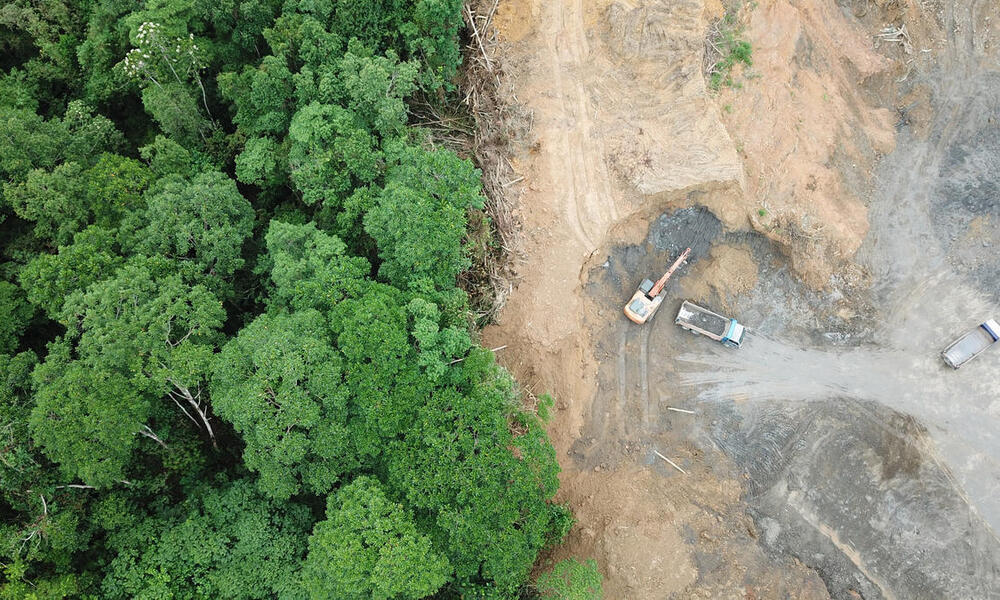
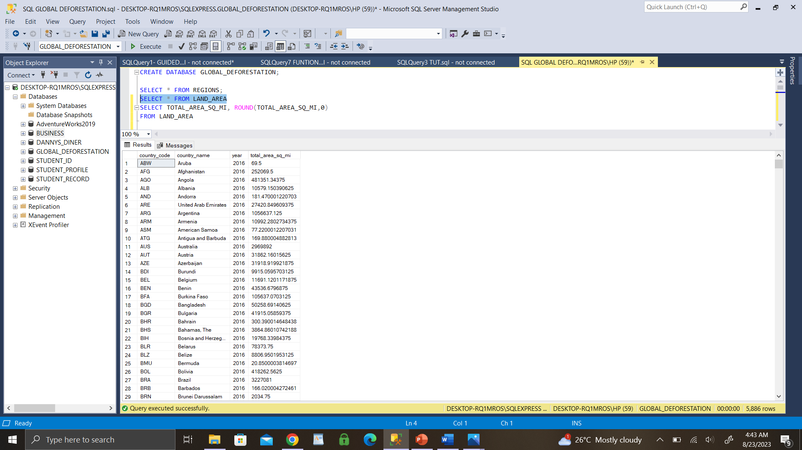
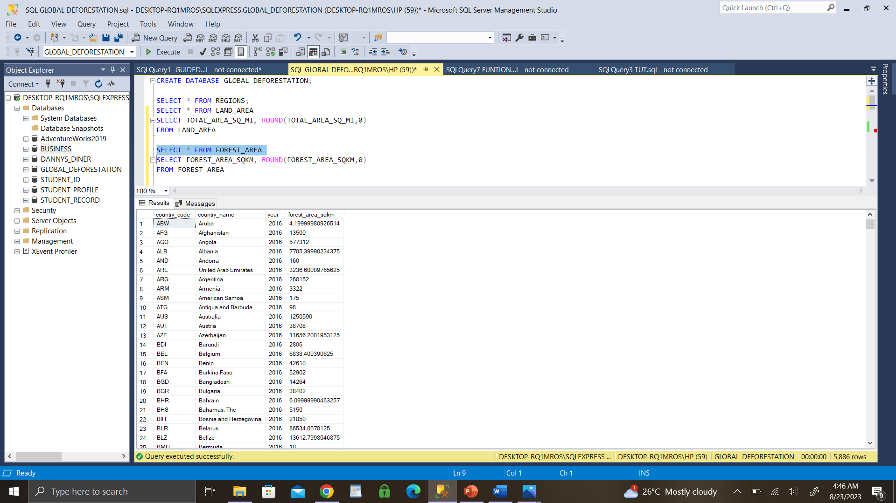
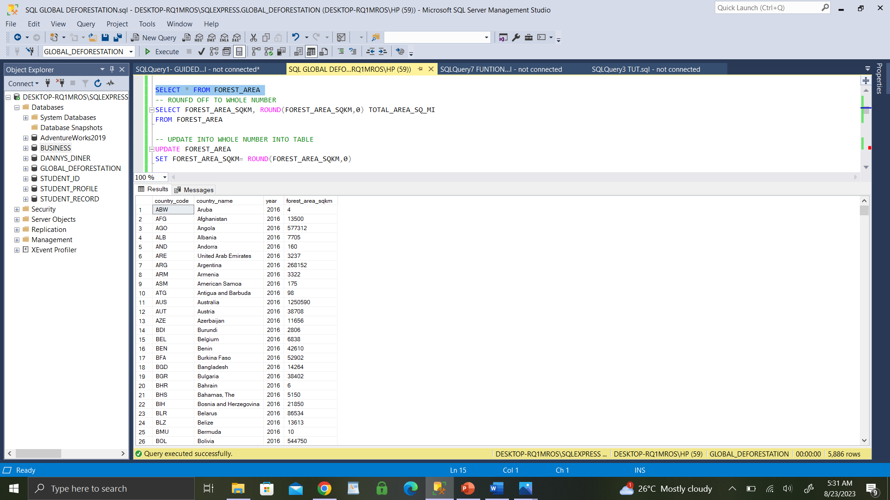
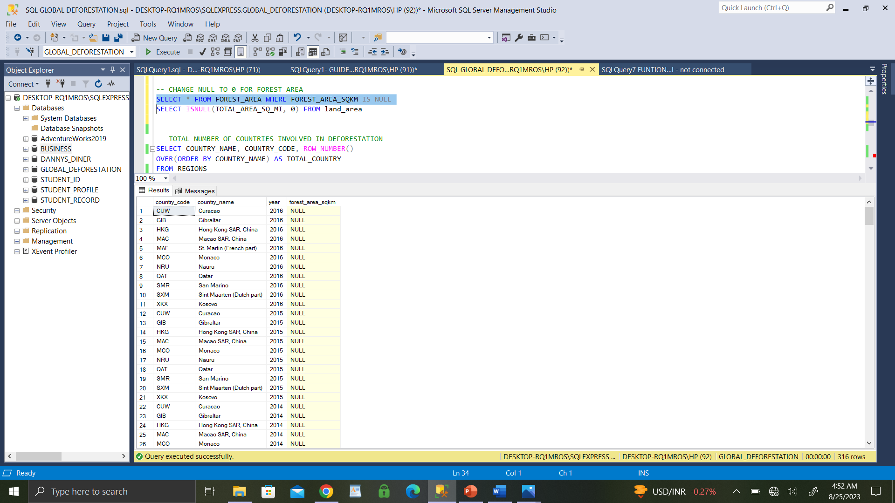
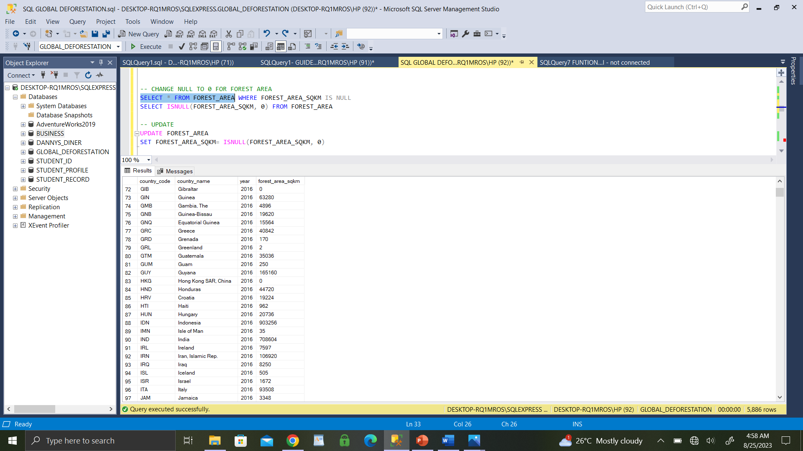

# SQL-PROJECT-- **GLOBAL DEFORESTATION**

## Introduction
This SQL project aim is to analyse Global deforestation dataset in order to help make predictive suggestions which can be used;
i. to reduce emmisions from deforestation
ii. to help forest degradation

**_Disclaimer_**: _All datasets do not represent any company, institution or country, this is just a dummy dataset to demonstrate use of SQL_.
--

## Data modification/cleaning
Modification in SQL refers to the process of altering the structure of an existing table
Cleaning data is the process of identifying incomplete, inaccurate prats of a dataset/table then replacing/modifying the dirty data fto enhance better analyses.
We've 3 datasets to wrok with, namely;
   - Regions
   - Land_area
   - Forest_area

## Skills Demonstrated to modify Land_area & Forest_area
- Rounding off to whole number 
- Modifying Null to zero(0)
- Update rounded off and zero value data into existing table

## Solutions

_**Land_area table before**_

_rounding off to whole_no_ **AND** _updating into existing table_
I use the syntax: SELECT ROUND(TOTAL_AREA_SQ_MI, 0)

_Update into existing table_

I used syntax: UPDATE LAND_AREA SET TOTAL_AREA_SQ_MI= ROUND(TOTAL_AREA_SQ_MI, 0)

_**Forest_area table before**_

_rounding off to whole_no_ **AND** _updating into existing table_
I use the syntax: SELECT ROUND(FOREST_AREA_SQKM, 0)

_Update into existing table_

I used syntax: UPDATE FOREST_AREA SET FOREST_AREA_SQKM= ROUND(FOREST_AREA_SQKM, 0)

_**Forest_area table with NULL**_

_**Modifying Null to zero(0) for Forest Area**_
I used syntax: SELECT ISNULL(FOREST_AREA_SQKM, 0) FROM FOREST_AREA

_Update into existing table_

I use syntax: UPDATE FOREST_AREA SET FOREST_AREA_SQKM= ISNULL(FOREST_AREA_SQKM, 0)

## Problem statement
1. Find the total number of countries involved in deforestation.
2. Show the income groups of countries having total area ranging from 75,000 to 150,000?
3. Determine the total forest area (in square kilometers) for countries in the "High Income" income group? Also compare with the other income categories.
4. What are the countries from each region or continent having the highest total forest area?
5. Retrieve the names of countries that have a forest area (in square kilometers) greater than the average forest area of all countries in the "High Income" income group.
6. Calculate the average total area (in square miles) for countries in the "Upper Middle Income" income group? 
 compare the result with the rest of the income categories.

## Skills Demonstrated

## Solutions/Analysis

**1. Find the total number of countries involved in deforestation.**

